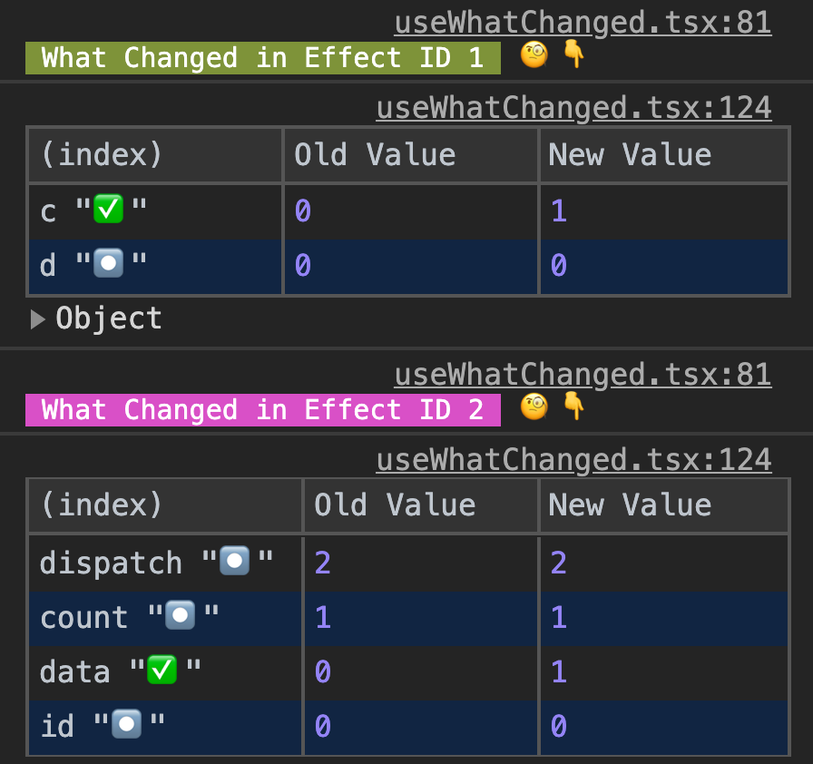
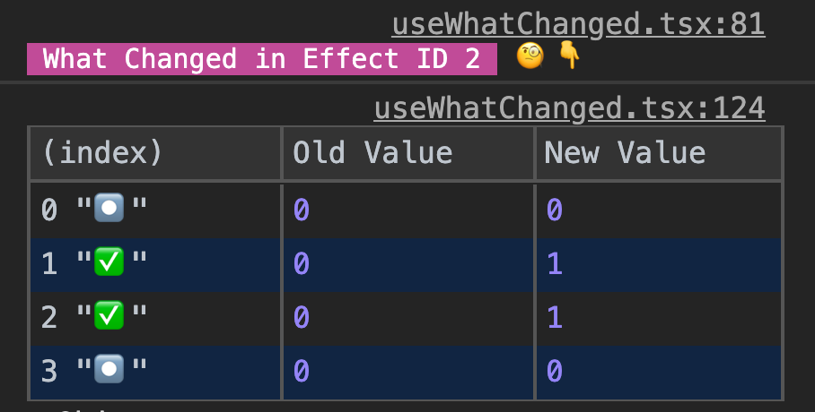
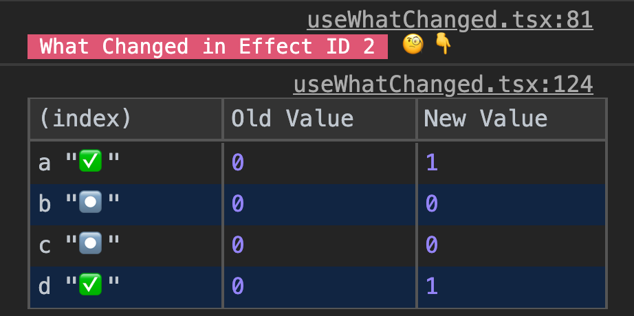
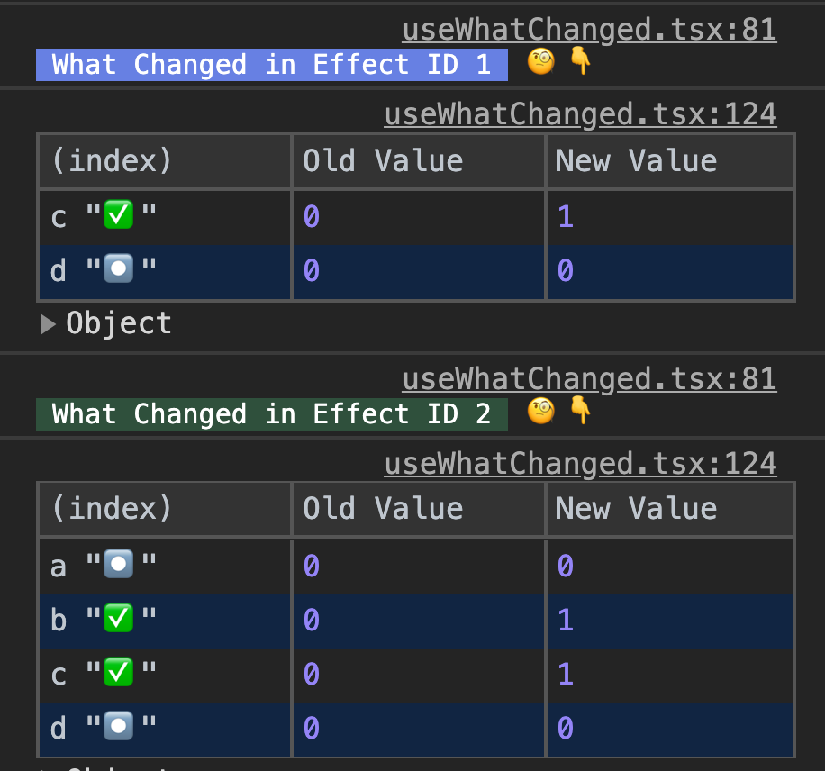
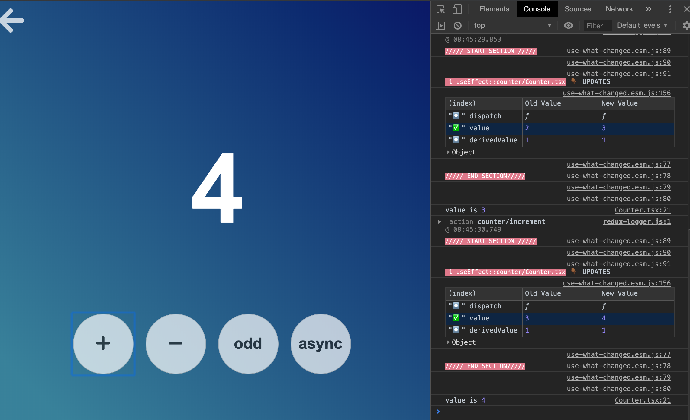

# use-what-changed

<h2  align="center">A tool and utility to debug major React hooks and custom hooks.</h2>
<h3 align="center">React | React native | React with Electron </h3>

<p  align="center">


</p>

<p  align="center"></p>

---

## Debug following hooks

*useEffect* *useCallback* *useMemo* *useLayoutEffect* *Custom hooks using core hooks*

## Working Example

Open the codesandbox link and see the console.
You can uncomment the other hooks, and see the console accordingly, when the value changes across rerenders.

[codesandbox use-what-changed example](https://codesandbox.io/s/simabthesailoruse-what-changed-demo-q94rn?file=/src/index.js)

## Install

If you use yarn. Run

```sh

yarn add @simbathesailor/use-what-changed --dev

```

If you use npm. Run

```

npm i @simbathesailor/use-what-changed --save-dev

```

## Motivation

I have been working on hooks for quite a long time. I use react hooks every day in my open source projects and also at work.

Now, using useEffect, useCallback, useMemo have really helped me compose the logic well together. But when the dependency list gets long. When I say long , it can be any thing greater than 3 for me and can be more or less for others.

With these large dependency array, I found it really difficult to debug and find out what is causing my useEffect to run again( same for useCallback and useMemo). I know two strategies to debug:

1. Break the useEffect logic into multiple useEffect. It is still fine, but expertise and time constraints will be there. People will not break the useEffect logic into smaller pieces first, they will try to spend time using logging the values and adding debugger so that not to change the production code.

2) Make use of usePrevious hook which can be defined something like this

```jsx
import React from 'react';

function usePrevious(value) {
  const ref = React.useRef(value);

  React.useEffect(() => {
    ref.current = value;
  });

  return ref.current;
}

export default usePrevious;
```

And can be consumed like this:

```jsx
const previousA = usePrevious(a);

const previousB = usePrevious(b);

const previousC = usePrevious(c);

useEffect(() => {
  if (previousA !== a) {
    console.log(`a has changed from ${previousA} to ${a}`);
  }

  if (previousB !== b) {
    console.log(`a has changed from ${previousB} to ${b}`);
  }

  if (previousC !== c) {
    console.log(`a has changed from ${previousC} to ${c}`);
  }
}, [a, b, c]);
```

However we can do it , it quite too much of work every time you run in the issue , where useEffect callback is running unexpectedly.

3. You are coming to an unknown code base, This plugin can really enhance your developer experience when working with hooks. It can give you a strong confidence for your changes done.

Even if you are coming to your own code after days. It becomes very diffucult to wrap you head around various multiple hooks . This library with babel plugin comes very handy to understand those scenarios.

4. It can help beginners to learn react hooks easily. The beginners can reason about their changes easily and also avoid unintended runs of hooks.

To solve the above problem, I tried to create something which can enhance developer experience in this case. Let's see my try for the above problems.

## Usage with babel plugin.

The package can also be used with a babel plugin which make it more easy to debug.

1. Run

```
npm i @simbathesailor/use-what-changed --save-dev
```

2. Run

```
npm i @simbathesailor/babel-plugin-use-what-changed --save-dev
```

Add the plugin entry to your babel configurations

```js
{
  "plugins": [
    [
      "@simbathesailor/babel-plugin-use-what-changed",
      {
        "active": process.env.NODE_ENV === "development" // boolean
      }
    ]
  ]
}
```

**Make sure the comments are enabled for your development build. As the plugin is solely dependent on the comments.**

Now to debug a useEffect, useMemo or useCallback. You can do something like this:

#### Debug individual hooks

```jsx
// uwc-debug
React.useEffect(() => {
  // console.log("some thing changed , need to figure out")
}, [a, b, c, d]);

// uwc-debug
const d = React.useCallback(() => {
  // console.log("some thing changed , need to figure out")
}, [a, b, d]);

// uwc-debug
const d = React.useMemo(() => {
  // console.log("some thing changed , need to figure out")
}, [a]);
```

#### Debug complete file or line below it.

```jsx
React.useEffect(() => {
  // console.log("some thing changed , need to figure out")
}, [a, b, c, d]);

// uwc-debug-below
const d = React.useCallback(() => {
  // console.log("some thing changed , need to figure out")
}, [a, b, d]);

const d = React.useMemo(() => {
  // console.log("some thing changed , need to figure out")
}, [a]);
```

So the example will debug all the hooks below line containing // uwc-debug-below.

No need to add any import for use-what-changed. just add a comment **uwc-debug** or **uwc-debug-below** above your hooks and you should start seeing use-what-changed debug consoles. No more back and forth across files and browser, adding debuggers and consoles.

This plugin provides following information :

**1.** Hook name which it is debugging.

**2.** File name where hook is written

**3.** Name of dependencies passed to hook.

**4.** what has changed in dependency array which caused the re-run of hook with symbol icons ( ✅, ⏺).

**5.** Tells you old value and new value of all the dependencies.

**6.** Tells you whether it is a first run or an update. I found it very helpful in debugging cases.

**7.** Unique color coding and id for individual hooks for easy inspection

<strong>Note: Frankly speaking the whole package was built, cause I was facing problems with hooks and debugging it was eating up a lot of my time. Definitely using this custom hook with babel plugin have saved me a lot of time and also understand unknown code using hooks</strong>

---

## Usage without babel plugin

1. When only dependency are passed as the single argument

```jsx
import { useWhatChanged } from '@simbathesailor/use-what-changed';

function App() {
  const [a, setA] = React.useState(0);

  const [b, setB] = React.useState(0);

  const [c, setC] = React.useState(0);

  const [d, setD] = React.useState(0);

  // Just place the useWhatChanged hook call with dependency before your

  // useEffect, useCallback or useMemo

  useWhatChanged([a, b, c, d]); // debugs the below useEffect

  React.useEffect(() => {
    // console.log("some thing changed , need to figure out")
  }, [a, b, c, d]);

  return <div className="container">Your app jsx</div>;
}
```

<p  align="center"></p>

Above snapshot show the console log when b and c has changed in the above code example.

2. Pass two arguments to useWhatChanged which makes it possible for useWhatChanged to log the names of the variables also.

```jsx
useWhatChanged([a, b, c, d], 'a, b, c, d'); // debugs the below useEffect
```

<p  align="center"></p>

## Color coding

A unique background color will be given to each title text. It helps us in recognising the specific effect when debugging. A unique id is also given to help the debugging further.

<p  align="center"></p>

## Demo link

[Demo link](https://ozj1e.csb.app/)

[Codesandbox link](https://codesandbox.io/s/cranky-tree-ozj1e)

[Medium article link](https://medium.com/@anilchaudhary453/debug-your-reactjs-hooks-with-ease-159691843c3a)

## Electron example


As this lbrary is just javascript and react. It can be used whereever
Reactjs exists.

I have included the setup for elctron app with a repo example. 

Todos: Need to add an example for react-native, which is work in progress. I will update it in a couple of days.

<p  align="center"></p>

[Electron repo link](https://github.com/simbathesailor/electron-learner)

## Contributing

Please read [CONTRIBUTING.md](CONTRIBUTING.md) for details on our code of conduct, and the process for submitting pull requests to us.

## Versioning

We use [SemVer](http://semver.org/) for versioning. For the versions available, see the [tags on this repository](https://github.com/your/project/tags).

## Authors

[simbathesailor](https://github.com/simbathesailor)

See also the list of [contributors](https://github.com/your/project/contributors) who participated in this project.

## License

This project is licensed under the MIT License - see the [LICENSE.md](LICENSE.md) file for details

## Contributors

Thanks goes to these wonderful people ([emoji key](https://github.com/all-contributors/all-contributors#emoji-key)):

<table><tr><td  align="center"><a  href="https://github.com/simbathesailor"><br  /><sub><b>Anil kumar Chaudhary</b></sub></a><br  /><a  href="https://github.com/simbathesailor/use-what-changed/commits?author=simbathesailor"  title="Code">💻</a>  <a  href="#ideas-simbathesailor"  title="Ideas, Planning, & Feedback">🤔</a>  <a  href="#design-simbathesailor"  title="Design">🎨</a>  <a  href="https://github.com/simbathesailor/use-what-changed/commits?author=simbathesailor"  title="Documentation">📖</a>  <a  href="https://github.com/simbathesailor/use-what-changed/issues/created_by/simbathesailor"  title="Bug reports">🐛</a></td></tr></table>
